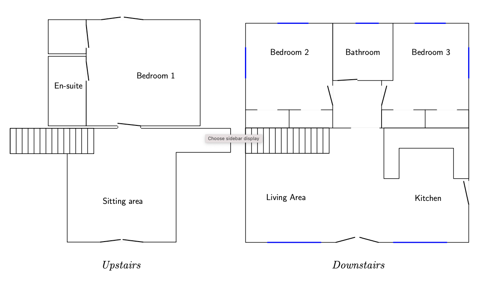

# Operating Manuals for Camelog

## Welcome to Camelog!

Welcome to Camelog, a genuine log house!

The aim of this manual is to simplify your vacation.
If this is your first time in Camelog you may want to sit down,
have some tea, and spend a few minutes glancing through these pages.

Here you will find a list of what we provide, how to operate
the appliances, and how to get in touch with the caretaker
if something is missing or not working.

We have also included some pointers on where to go for shopping, sightseeing, etc.



## If you need assistance

### Telephones

You will notice that the reception for cellphones is very weak around here.
The signal is slightly better on the deck outside.

The telephone in the kitchen accepts incoming calls to 01841-540764 but
outgoing calls are restricted to emergency calls and 800-calls.

Telephone cards that use 800-numbers can be purchased in most grocery stores.
(Make sure that the clerk understands that you're not asking for a *mobile*
phone card.)

### Power failure

In the event of a power failure, a torch under the staircase should
come on.  There should also be some candles and matches in one of
the kitchen dresser.

### Medical care

Dial 999 or 112 only in an emergency where there is danger to life
or a crime in progress.  This includes the Police, Fire Brigade,
Ambulance Service or Coastguard.  When asked for your adress, state
the following:
```
 Camelog, Rosehill
 Little Petherick
 Cornwall PL27 7QT
 Telephone: 01841-540764
```

Here are some other useful numbers.

- Electricity: Western Power Distribution, 0800-365900.
- Gas emergency: Transco, 0800-111999.
- Water: South West Water, 0800-1691144.
- Animal welfare: RSPCA, 0870-5555999.
- Hospitals:

For serious injuries and sudden illness, call
the Royal Cornwall Hospital (Treliske) in Truro: 01872-250000.

For other information such as how to contact a doctor or
dentist on duty, call NHS Direct on 0845-4647.

Refer to page 12 and 13 in the Yellow Pages for other important 
phone numbers.

### Your caretaker

There should be leaflets in the house with contact information.

## Overview of the house

The next few sections will describe where to find things
(such as the ironing board) and give simple instructions on how to
perform *typical jobs*, like washing some clothes.
We're assuming that you have used similar appliances
before and just need to know what buttons to push to get the job done.

You will find manuals for some of the appliances at the end of this 
booklet in case you need to do something out of the ordinary,
or simply forgot to bring a book for your holiday.

Let us now start with the most button-populated part of the house, 
namely the kitchen.

### Kitchen

As a general rule of thumb, if some of the appliances don't seem to
work, please make sure that the socket switch is on.  For instance,
the hob/oven, washing machine, washer/dryer and the extractor all
have a main switch on the wall -- these are all labelled.

#### Dishwasher

The caretaker provides you with the first tablets needed to run the dishwasher.

- Scrape or rinse off excess food and put the crockery in the machine.
- Put a tablet in the compartment and slide the lid over it until it 
  snaps on, as shown in the picture.
- Turn on the machine by pressing the button appearing in the
 lower left corner in the picture.
- Shut the door and the dishwasher will start.
- After about 2.5 hours the machine will beep five times, 
 signalling it is done.  (It will beep again
 after another ten minutes, and then again, and then one more time,
 but will stay quiet after that.)
- Open the door, turn off the power and let the crockery dry.

Please do not wash wood, for instance knives with the wooden handles.


