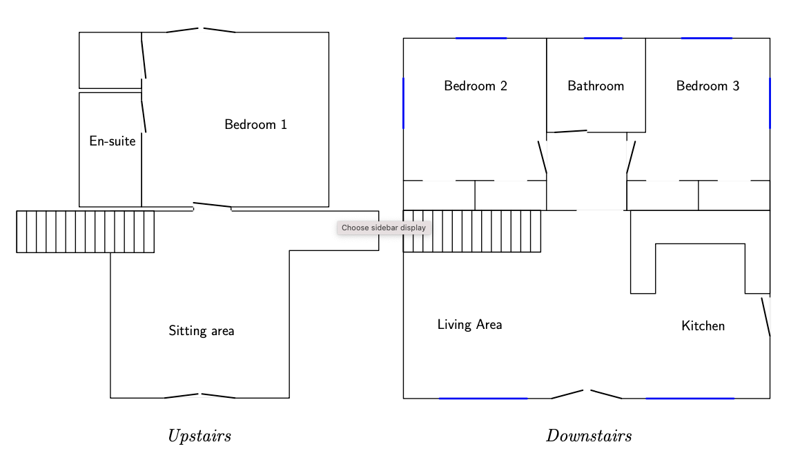
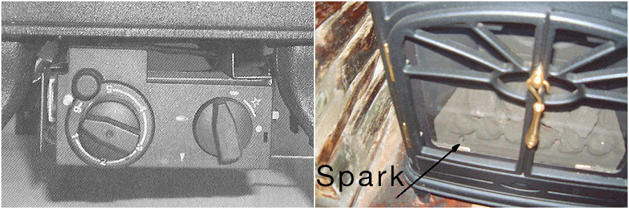

# Welcome to Camelog!

Welcome to Camelog, a genuine log house!

The aim of this manual is to simplify your vacation.
If this is your first time in Camelog you may want to sit down,
have a cup of tea, and spend a few minutes glancing through this
document.

If you are reading this on paper, you may also want to refer to the
online version of this document which is more up-to-date and contains
links to manuals and other sites: `github.com/kjepo/camelog/`

Here you will find a list of what we provide, how to operate
the appliances, and how to get in touch with the caretaker
if something is missing or not working.

We have also included some pointers on where to go for shopping, sightseeing, etc.

## Table of contents

1. [ If you need assistance ](#assistance)
 - [ Telephones ](#telephones)
 - [ Power failure ](#powerfailure)
 - [ Medical care ](#medicalcare)
 - [WIFI](#wifi)
 - [ Your Caretaker ](#caretaker)

2. [ Overview of the house ](#overview)

 - [Keys](#keys)
 - [Kitchen](#kitchen):
  [ Dishwasher ](#dishwasher)| [ Washer/dryer ](#washerdryer)| [ Hob and oven ](#hoboven)| [ Microwave ](#microwave)
 - [Living Area](#livingarea):
  [ Sky TV ](#skytv)| [ Stereo ](#stereo)| [ Fireplace ](#fireplace)
 - [Downstairs bathroom](#downstairsbathroom)
 - [Patio and garden](#patio-garden)
 - [Bedrooms](#bedrooms)
 - [Ironing](#ironing)
 - [Cot and high chair](#cot)
 - [Heating/thermostats](#heating)
 - [Garbage](#garbage)

3. [Tourist attractions](#attractions):

  - [ Eden Project ](#eden)| [ Tintagel ](#tintagel)| [ Beaches ](#beaches)| [ Walking ](#walking)|
  [ Biking ](#biking)| [ Golf ](#golf)

4. [Useful places](#places):

  - [ Pharmacies ](#pharmacies)| [ Movie theathres ](#movie)|
  [ Grocery shopping](#grocery) | [ Pubs ](#pubs)| [ Padstow ](#padstow)| [ Wadebridge ](#wadebridge)|
  [ Truro ](#truro)



<a name="assistance"></a>
# 1. If you need assistance

<a name="telephones"></a>
## Telephones

You will notice that the reception for cellphones is very weak around here.
The signal is slightly better on the south-facing side.

The telephone in the kitchen accepts incoming calls to `01841-540764` but
outgoing calls are restricted to emergency calls and 800-calls.

Telephone cards that use 800-numbers can be purchased in most grocery stores.
(Make sure that the clerk understands that you're not asking for a <i>mobile</i>
phone card.)

<a name="powerfailure"></a>
## Power failure

In the event of a power failure, a torch under the staircase should
come on.  There should also be some candles and matches in one of
the kitchen dresser.

<a name="medicalcare"></a>
## Medical care

Dial `999` or `112` only in an emergency where there is danger to life
or a crime in progress.  This includes the Police, Fire Brigade,
Ambulance Service or Coastguard.  When asked for your adress, state
the following:
```
 Camelog, Rosehill
 Little Petherick
 Cornwall PL27 7QT
 Telephone: 01841-540764
```

Here are some other useful numbers.

- Electricity: Western Power Distribution, `0800-365900`
- Gas emergency: Transco, `0800-111999`
- Water: South West Water, `0800-1691144`
- Animal welfare: RSPCA, `0870-5555999`
- Hospitals:

For serious injuries and sudden illness, call
the Royal Cornwall Hospital (Treliske) in Truro: `01872-250000`

For other information such as how to contact a doctor or
dentist on duty, call NHS Direct on `0845-4647`

Refer to page 12 and 13 in the Yellow Pages for other important 
phone numbers.

<a name="wifi"></a>
## WIFI

Camelog has fibre-optic broadband with speeds up to 100 Mbit/s.
The password is written on cards left around the house.
The WIFI name is simply `Camelog`.

The router itself is in bedroom 3's closet if you need to restart it.

Please don't change any settings, or download illegal material or engage
in criminal activities so that we can continue to offer free WIFI access.

<a name="caretaker"></a>
## Your caretaker

There should be leaflets in the house with contact information.

You can contact Trevose Property Management at `07482136198` (main line)
or maintenance at `07455271843`

<a name="overview"></a>
# 2. Overview of the house

The next few sections will describe where to find things
and give simple instructions on how to
perform typical jobs, like washing some clothes.
We're assuming that you have used similar appliances
before and just need to know what buttons to push to get the job done.

You will find links to manuals for some of the appliances throughout
this document.

Let us now start with the most button-populated part of the house, 
namely the kitchen.

<a name="keys"></a>
## Keys

You won't need keys to the house.  Instead, when you rent the
house you will be given a (temporary) key code to the door.

Make sure you close the door properly when you leave the house:
there will be "oh-oh" sound if you don't shut it properly.

In the unlikely event that the batteries for the door have died,
there should be a 9V-battery placed in a plastic box under the
trap door where the gas meter is, approximately 2m to the right
of the door.  The 9V battery can be held under the keypad to
power the lock enough to get in.  Then please contact the caretaker
to have the batteries replaced.  The lock accepts 4 AA alkaline
batteries, located behind a lid which is removed with a small hex key.

[9V emergency battery](https://help.yale.co.uk/how-to-open-keyless-smart-door-batteries-flat/)


<a name="kitchen"></a>
## Kitchen

As a general rule of thumb, if some of the appliances don't seem to
work, please make sure that the socket switch is on.  For instance,
the hob/oven, washing machine, washer/dryer and the extractor all
have a main switch on the wall &mdash; these are all labelled.

<a name="dishwasher"></a>
### Dishwasher

[Manual for dishwasher](manuals/dishwasher.pdf)

[Instruction video for dishwasher](https://www.youtube.com/watch?v=M7D0U7y1tDk)

<b>Note:</b> If the plates don't fit in the lower rack it means
that someone has lowered the <i>upper rack</i>.  You can simply lift the
basket to make sure the arm clears the plates. This is described on
page 4 in the manual.

The caretaker provides you with the first tablets needed to run the dishwasher.

- Scrape or rinse off excess food and put the crockery in the machine.
- Put a tablet in the compartment and slide the lid over it until it 
  snaps on, as shown in the picture.
- Turn on the machine (leftmost button)
- Select a program by pressing `P`, we recommend 65º.
- Press the play button &#x25B7;
- Shut the door within 4 seconds and the dishwasher will start.
- After a couple of hours the machine will beep, 
 signalling it is done.
- Open the door, turn off the power and let the crockery dry.

Please do not wash wood, for instance knives with the wooden handles.


<a name="washerdryer"></a>
### Washer/dryer

<a href="https://youtu.be/ZexcRzTvNgs">Video tutorial for washer/dryer</a>

<a href="manuals/aqualux-1200-washingmachine.pdf">Manual for washer/dryer</a>


The following is a simplified series of steps that
tells you how to do a typical 40ºC wash of cotton clothes.
For more elaborate programmes, please refer to the more detailed manual above.

If the machine doesn't respond, check first that the power switch is on,
located on the wall above the worktop surface.

- Put in a detergent tablet (a few should be supplied), 
  with the rest of the clothes.
- Turn the rightmost dial <i>clockwise</i> to `D`
- Optionally add softener to the pull-out tray, rightmost compartment.
- Start the machine by pressing the ON/OFF button which is the 
  rightmost of the rectangular buttons.  The mains-on light
  comes on and the machine starts operating.

The program takes roughly two hours.

The door is controlled by a safety device which releases a minute
or so after the end of the programme.

- Switch the machine off by pressing the ON/OFF button again, and
  the mains-on light goes out.


<a name="hoboven"></a>
### Hob and oven

[Manual for Neff hob](manuals/neff-hob.pdf)

The induction hob works just like a regular electrical hob,
but pots and pans must be made of steel or cast iron.
If you have brought your own, pans made of aluminium, brass and copper
won't work unless they're specially designed for induction and have a
ferrous base. Stainless steel will only work if its base is made of magnetic
grade steel.

[Manual for Smeg oven](manuals/Smeg-oven-DUSF400S.pdf)

There are two ovens: the lower one is the main fan-assisted oven
while the upper is the auxiliary oven and is good for smaller items.

Each oven has its own function/temperature knob: the left knobs
are for the upper oven while the rightmost knobs are for the lower oven.

To heat food in the lower oven, turn the rightmost knob to the fan symbol.
Then turn the adjacent temperature knob to the desire temperature.
Wait for the thermostat light to go out (oven is preheated).
Place the food on a tray on the middle shelf which gives even heat
from all sides.

**Note:** if there has been a power cut, the lower oven controls appear "dead",
but the upper oven works.  If this happens:

- Look at the clock display.
- Press and hold the clock key for about 2 seconds until the time starts flashing.
- Use +/- to set the correct time.
- Wait about 7 seconds without pressing anything.

When the small dot stops flashing, the oven is unlocked.

<a name="microwave"></a>
### Microwave

[Manual for Panasonic microwave](manuals/microwave-panasonic.pdf)

To heat food, place it in a microwave-safe dish on the glass tray and
close the door. If you want full power, just enter the time (or press
"Quick 30") and press Start.  Each press on "Quick 30" adds 30 seconds
at full power.

The microwave oven defaults to High (800 W). To change the power, press "Micro Power"
repeatedly until the desired level appears (High, Defrost, Medium, Low, or Warm),
then enter the cooking time and press Start (the red circle/triangle at the bottom).
You can open the door to stir or turn the food during cooking; close it and press
Start again to continue. When finished, let the food stand briefly so the heat
evens out before eating.

<a name="livingarea"></a>
## Living Area

<a name="skytv"></a>
### Sky TV

There are two remote controls, one for the TV and one for the Sky box.

The Sky remote has been programmed to turn on the TV as well.

If the Sky box doesn't come on, press the `tv guide` button to
wake it up.  If that doesn't help, make sure the TV is using `HDMI 1`
by clicking on the input select on the black TV remote.

The TV has a USB port on the left hand side if you have films or
photos on a USB flashdrive. 

(The DVD player at the bottom is currently not connected.)

<a name="stereo"></a>
### Stereo
The stereo can play off your phone if you connect with a USB-cable
or if you pair it with Bluetooth:

- Press `BT Audio`:  "Pairing" wil be displayed.
- On your phone, select the `X-CM32` device.

Radio reception is (you guessed it) weak around here.  We recommend
listening to the radio via one of the Sky channels.  Select 
`tv guide` and then choose the category for Radio and Music to
see what is available.

<a name="fireplace"></a>
### Fireplace

<p>
The fireplace features a flueless gas stove, capable of giving off
about 3kWs of heat.  On the bottom right side of the stove there are
two knobs.  The one closest to you is the <i>thermostat</i> while the
one further back is the <i>control knob</i>.
</p>

<p>
The stove is fail-proof in that gas is only flowing when the control
knob is pressed in.  It is not possible to accidentally leave gas running.
</p>



<p>
The left figure shows the thermostat knob (left) and control knob (right).
The right figure shows where the spark will occur.
</p>

<p>
To light the stove, follow these instructions:

- It is a lot easier to start the fire if you can hear what is going on,
so turn off the TV and stereo before you begin.
- Stand on your knees so that you can see the hole in the left
hand side of the matrix (see photo above).
- If you can see a flame, the caretaker has probably already lit the stove
and all you have to do to turn on the main burner is to turn 
the control knob further counterclockwise.
- If there is no flame, first turn the thermostat knob all the way 
counterclockwise to position 6.  Then turn the control knob
counterclockwise until reaching a stop, roughly when the dial
is pointing straight up.  Now press down the control knob and hold
for about five seconds &mdash; you will hear the pilot gas flowing.
- While still pressing down the knob, turn further counterclockwise
to activate the piezo spark (you will hear it).
Keep the knob down for a further
ten seconds after the pilot has been lit.  You should be able
to see the pilot spark as shown in the photo above.
If the pilot does not light, turn the control knob back to where
the pilot gas is flowing and try again.
- When the pilot has been lit (after about 10 seconds), release the
knob and turn the control knob counterclockwise so that the
dial is pointing towards you.  The main burner will now light
and burn in accordance with the thermostat knob setting.
- At any of the temperature settings the stove may operate at any input
between the maximum and minimum or if the room temperature continues
to rise, the main burner may switch off.  As the room temperature
falls the main burner will light again.
- If the pilot is extinguished during use of the stove, you <i>must</i>
wait ten minutes before repeating the ignition procedure.
- To turn the main burner off, keeping the pilot flame lit, turn the
control knob clockwise back to the pilot position (dial pointing upwards).
After a while, the burner flames die out and only the pilot will remain lit.
- Running only the pilot is inexpensive and simplifies turning the stove back on.
- To shut the stove off completely, press the control knob down and 
continue turning clockwise until the dial is pointing away from you.  When the
stove is off you won't hear the gas flowing.
- A safety interlock prevents re-ignition of the pilot flame until the
thermocouple has cooled sufficiently to allow the magnetic valve unit
to reset itself. The elapse time depends on the temperature of the stove.
</p>

<a name="downstairsbathroom"></a>
## Downstairs bathroom

If you intend to use the whirlpool facility in the bath tub, we
recommend that you first fill up the tub so that the water is roughly
at the level of the seat, or at least above the jets, <i>before</i>
turning on the jets. Turning on the whirlpool with less water will
send water all over the bath room.

An artifact of the combination boiler is that water tends to 
be hotter when the tap is not fully open.  
The whirlpool has a tendency to produce large amounts of foam
when bubble bath is added.  It is therefore best to add the liquid
gradually &mdash; a couple of spoons is usually enough.

There are two controls at the right side of the tub, one button to
turn on the whirlpool and one dial to set the intensity of the jets.
If the whirlpool button doesn't work, someone may have turned off
the master switch on the other side of the wall, in bedroom 2.
If you have problems turning the whirlpool off, you might be holding
the button down for too long &mdash; it only needs to be quickly tapped.

<a name="patio-garden"></a>
## The patio and garden

We don't provide a barbecue as we don't have a facility for
handling hot ashes.  If you are bringing your own grill
please *do not* barbecue on the patio and *do not* leave
hot ashes in the garbage bin.

The mattresses for the patio chairs and seat cushions are stored in the box outside
on the patio.  During the winter season they might be locked up
in the shed or stored under the staircase.

<a name="bedrooms"></a>
## Bedrooms

Each bedroom has a firm and a medium firm mattress. 
The firm one is always on the right side as you come into the room.

<a name="ironing"></a>
## Ironing

There is an iron and an ironing board in bedroom 3's cupboard.
The black handle under the ironing board releases the legs.
Hold it again when collapsing the board.

<a name="cot"></a>
## Cot and high chair

A cot and a high chairs are also found in bedroom 3's cupboard.
To fold the cot back together, remove the pad and use the hole
to pull the floor up.

If you need to rent other types of cots, buggies, safety gates, etc,
try Babes & Bikes on 9 Polmorla Walk, Wadebridge `01208-815262`

<a name="heating"></a>
## Heating and thermostats

The house is heated with underfloor heating, divided up into five
different zones, each controlled by an individual thermostat.

There is one thermostat, next to the sofa in the downstairs living room,
which has a dial which you can just turn to a desired temperature &mdash;
no need to click, just turn the dial.

[Thermostat manual](manuals/thermostat.pdf)


The other thermostats are programmed to maintain reasonable temperatures
throughout the day.  If you're hot or cold, you can temporarily decrease
or increase the temperature using the arrow keys.
This will adjust the setting temporarily until the next time slot.

<a name="garbage"></a>
## Garbage

Garbage is picked up on changeover (Saturdays).  Please seal the black bags
before depositing them in the garbage bins.


<a name="attractions"></a>
# 3. Tourist attractions

Included here are just a few local attractions around North Cornwall.
For more information, please consult the AA's guide to Cornwall in 
the bookshelf.

<a name="eden"></a>
## The Eden Project

Unless you've been marooned on an island for a long time, you must
have read about the
[Eden project](https://www.edenproject.com)
or seen pictures of the large biomes.
The Eden Project is supposedly the biggest tourist attraction in the UK
and only half an hour's drive away from here.

Plan to spend around two to three hours there.  It is sensible to wear layers
of clothing as parts of the tour is warm and humid.

<a name="tingtagel"></a>
## Tintagel Castle

While it is difficult to say whether King Arthur really existed, 
experts seems to agree that there was a great warrior in the
west of England who had a fortress where
[Tintagel Castle](https://www.english-heritage.org.uk/visit/places/tintagel-castle/)
is today. That original fortress is gone but archeologists seem to
think that people lived there in the fifth century.  The replacement
castle was built between 1230-1236 but within two hundred years the
castle was in ruins and remains so to this day.

Visiting the castle requires a bit of walking and climbing but with
the new bridge it is much easier. Once you are at the top you can
enjoy some beautiful coastal scenery.  Plan to spend at least an hour
here and make sure it is open before you go down by calling
`01840-770328`

In combination with a trip to Tintagel you could also visit Boscastle
(now rebuilt after the flash flood) or enjoy a pint on the way back
at Port William's pub, Trebarwith strand.

<a name="beaches"></a>
## Beaches

On the Padstow side of the estuary is Harlyn bay and Trevone bay.
Further south is Newquay with some of the best surfing beaches in
Europe.  For small secluded coves, follow the trail north out of
Padstow's harbor.  For longer stretches of sand, either drive or take
the ferry over to Rock and Daymer bay on the other side of the
estuary.

<a name="walking"></a>
## Walking

Local footpaths leading into Padstow start in Little Petherick and
initially follows the creek on this side of the bridge (Saints' road).
The trail is about 3 miles and finally merges with the Camel Trail.

<a name="biking"></a>
## Biking

We really recommend going on the Camel Trail: it is flat, it is
beautiful, and you can bike from Padstow to Wadebridge along
the River Camel without any motor traffic.  

Bikes can be rented in either Wadebridge or Padstow.  For instance,
Bridge Bike Hire in Wadebridge `01208-813050`;
you'll find them along with similar businesses as you drive into
Wadebridge.  They are all conveniently located next to the Camel Trail.

<a name="golf"></a>
## Golf

Near Constantine Bay is Trevose Golf and Country Club, `01841-520208`
For other golf clubs, see the Yellow Pages under "Golf Clubs".

<a name="places"></a>
# Useful places

<a name="pharmacies"></a>
## Pharmacies

There is a <a href="https://www.google.com/maps/place/Boots/@50.5160094,-4.8381324,17z/data=!3m1!4b1!4m5!3m4!1s0x486b76bde5102a57:0x196f70ef733d0d0f!8m2!3d50.5160008!4d-4.8359962">Boots</a> in Wadebridge.
<a href="https://www.google.com/maps/place/Tesco+Superstore/data=!4m5!3m4!1s0x486b16486b6386e9:0x9527b01fc25408fa!8m2!3d50.2608871!4d-5.046934">Tesco</a> in Truro stay open later and has a pharmacy section, call `01872-357400`

<a name="movie"></a>
## Movie theatres
If you are bored with Sky and DVDs you can visit the
local movie theatre in Wadebridge

- <a href="https://wtwcinemas.co.uk/wadebridge/whats-on/">Regal Cinema</a>
The Platt in Wadebridge, telephone `01208-812791`

<a name="grocery"></a>
## Grocery shopping

There is a [Tesco](https://www.google.com/maps/place/Tesco+Superstore/@50.5351339,-4.9482304,17z/data=!3m1!4b1!4m5!3m4!1s0x486b7526e2947f33:0xdcd02990bb2c5d88!8m2!3d50.5351339!4d-4.9460417)
in Padstow, five minutes away by car.  A larger [Tesco](https://www.google.com/maps/place/Tesco+Wadebridge/data=!4m5!3m4!1s0x486b742036e63c81:0xc5f351c0848c1cbd!8m2!3d50.5171705!4d-4.8567691)
with longer opening hours is found ten minutes away on this side of
Wadebridge.

Downtown Wadebridge is the Co-op with lots of parking by the River Camel.

Driving a little bit further to Truro, there is Waitrose outside near the Park Ride,
Marks \& Spencer located conveniently near the centre with indoor parking
and Sainsbury's up on the other side of Truro.

<a name="pubs"></a>
## Pubs

A list of some nearby pubs:

- Pickwick in Burgois, `01841-540361`
- Ring o'Bells in St Issey, `01841-540251`

<a name="padstow"></a>
## 5 minutes away: Padstow

Padstow is the little fishing village known for its seafood
restaurants and, recently, Rick Stein's.  In the summer months, the
narrow streets are packed with people who are there either to try the
fresh fish, visit the many shops that stay open until late, or just
sit by the harbor and look at the boats.

A ferry takes you across the estuary to Rock and Daymer bay.  Make
sure to visit the hushed church of St Enodoc where Sir John Betjeman
is buried.

Padstow is also the end of the Camel Trail, the old railway line which
is now a cycle and footpath, winding 18 miles along the River Camel
all the way to Poley's Bridge in the foothills of Bodmin Moor.  If you
want to go on the Camel Trail you may want to rent a bicycle in
Wadebridge, bike to Padstow, have lunch, and then go back.

<a name="wadebridge"></a>
## 10 minutes away: Wadebridge

Wadebridge is the town you would go into for everyday errands.
Here you will find a post office, pharmacy, groceries, etc.

<a name="truro"></a>
## 30 minutes away: Truro

Truro is the capital of Cornwall and was recently awarded the
nomination "best little town" in the UK.  If you are a serious shopper
and don't want to drive too far, Truro is the place to go.  You'll
find plenty of parking at Marks & Spencer which is not free but
available and close to the centre.
